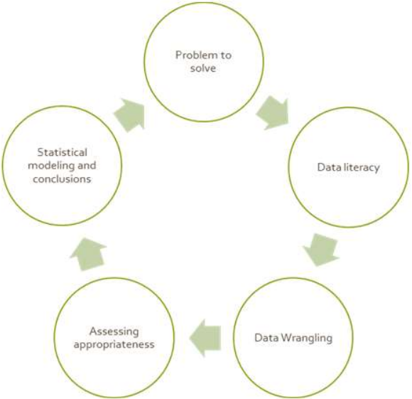
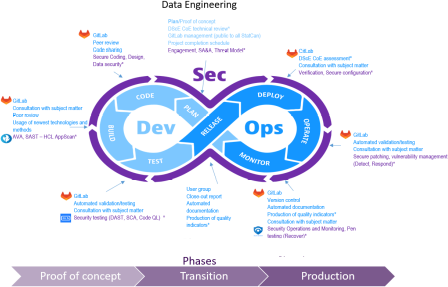

class: inverse

```{r include=FALSE}
library(ggplot2)
filter <- dplyr::filter
knitr::opts_chunk$set(warning=FALSE, message=FALSE, fig.width=10.5, fig.height=4, 
  comment=NA, rows.print=16)
theme_set(theme_gray(base_size = 24))
```

## Statistics Finding Its Place

Thank you for inviting me to be the discussant for this session on statistics
and data science.

---

class: inverse

## Converting Statistical Resources (Sanchez)

From the talk:

--

* In all the examples mentioned, everything involved one or more steps in the data science
cycle, at the level appropriate for the moment and skill set of students, has been used.
* The examples involve a variety of data sets, and some very large data sets. In some we
present the same data in very different ways, depending on our goals.
* But all the activities involve introductory statistics concepts in our classical curriculum
for introductory stats, probability or time series.

---

class: top

## $\;$

<center>

</center>

---

class: inverse

## Thoughts

* I enjoyed the optimism

--

* It's important to remember our rich history, and not throw it all out

--

* Our 'value add' can sometimes be "slow down, think about your data"

--

* Any chance we get to integrate UQ should be taken


---

class: inverse

## Statistical Literacy: A Concept Map (Schield)

From the talk:

--

* wonderful that students understand the point of the course

--

* also a really great way to encourage critical thinking

--

* I really like CARE and putting Confounding front and center

--

* A note that the definition of *effect size* is in some dispute


---

class: top

## $\;$

<center>

</center>

---

class: inverse

## Embracing Data Science (Sarakinos)

From the talk:

--

* This is a hard problem

--

* Governments really aren't built to move at the speed of change that we are facing and experiencing

--

    - and we probably don't want them to be?
    
--

* Recruitment is a very real problem, especially with the salary disparity

--

* But the problems faced (response rates; survey quality; classic data gathering) are immense, so so form of solutions are needed

--

* Basically: a lot of sympathy!

---

class: top

## $\;$

<center>

</center>


---


class: inverse

## Key Take-Aways

* some of these problems are things we've been discussing for decades

--

* student interest is not!

--

* important to move fast enough that statistics remains a core discipline in this area, while ...

--

    - not throwing out what makes our profession valuable

--

* no answers, just questions and challenges
    
---

layout: false
class: inverse, middle

<center>
<a href="http://www.trentu.ca/math/"></a> &emsp;&emsp;
<a href="https://creativecommons.org/licenses/by/4.0/"></a>
</center>

## $\;$

- Contact me: [Email](mailto:wesleyburr@trentu.ca)
- Slides created via the R package [xaringan](https://github.com/yihui/xaringan) by Yihui Xie
- Slides and source at <http://bit.ly/jsm2023data>

<br/>

